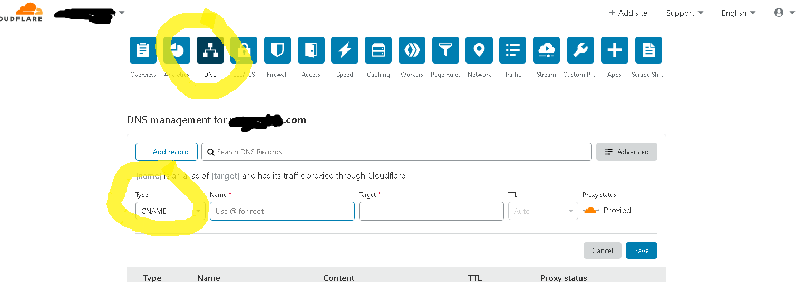

# Continuous Deployment of any static site to AWS S3 bucket in less than 30 minutes!

# Table of contents
  - [Why do I want to do this?](#why-do-i-want-to-do-this)
  - [What is this about?](#what-is-this-about)
    - [Why?](#why)
    - [Why Not?](#why-not)
  - [The steps involved](#lets-dive-in)
    - [Start local Github repo, or use an existing one.](#start-local-github-repo-or-use-an-existing-one)
    - [Connect your repo to Github](#connect-your-repo-to-github)
    - [Explore Github Actions](#explore-github-actions)
    - [Let's actually make a Github Actions](#lets-actually-make-a-github-actions)
    - [AWS S3](#aws-s3)
    - [Create a new AWS user to upload to your bucket](#create-a-new-aws-user-to-upload-to-your-bucket)
    - [S3 Bucket Policies](#s3-bucket-policies)
      - [Give `PutObject` and `DeleteObject` permissions](#give-putobject-and-deleteobject-permissions)
      - [Give `GetObject` permissions to public](#give-getobject-permissions-to-public)
    - [S3 Static Site Hosting](#s3-static-site-hosting)
    - [Github Secrets](#github-secrets)
    - [OK we have everything wired up!](#ok-we-have-everything-wired-up)
    - [BONUS: What good is a long ugly endpoint?](#bonus-what-good-is-a-long-ugly-endpoint)
  - [Summary](#summary)

## Why do I want to do this?
Static sites are all the rage in the galaxy at the moment.

The internet started with them, if you still can remember.
|  |
|:--:|
| *Million dollar page screenshot (Disclaimer: I am not affiliated with them in any way)* |

Then we got adventurous running bigger and bigger backend servers with whatever programming language we can lay our hands on.
The trouble we soon realised is that there are simply too many humans in this world, and the moment something goes viral, **everyone** wants to have a piece of it.
|  |
|:--:|
| *Burning Servers* |

Me sleeping at 3am: "No Sir, I'm not going to rescue your burning servers right now, not even if you pay me double."

So we came up with more and more complexity in autoscaling, CDN and many crowd control measures. They still work and are very much a large part of our current world, nothing wrong.

And developers started moving towards a `serverless` stack which is quite a misnomer as well. Before discovering a [new type of hell](https://medium.com/xebia-engineering/11-reasons-why-you-are-going-to-fail-with-microservices-29b93876268b).

**This article will share with you how to "keep it simple", commit to github, publish to website, sleep in peace, rinse and repeat**

##What is this about?
By the end of this article, you should be able to:
- Make a `git push`
- Make `github actions` pick up on any deployments
- Publish your site on an S3 bucket automatically

###Why?
- It's simple.
- It's cheap, infinitely, actually free for low traffic sites.
- It scales, infinitely.
- You can run tests before you deploy (please stay tuned for the next article!).

###Why Not?
- It appears rather daunting. (If you stop reading here and not continue.)
- The configurations might kill me. (Perhaps it might without a guiding hand here.)
- Without some human eyeballs, you might actually deploy something you do not want to deploy out in the public domain. Like secrets, passwords, keys and who your girlfriend is. (You could start by adding [the following](https://github.com/punggolzenith/e28/blob/master/independent-study/.gitignore) to your `.gitignore`)
- It's really static. :stuck_out_tongue_winking_eye: (Unless you start adding microservices, lambda functions, databases to it, and again, stay tuned for the next article)

##Let's Dive in!

Here are the overview of the steps involved.

###Start local Github repo, or use an existing one.
Go to the directory you want to start your repo or an existing repo. `git init`. Write some code. Stage the changes with`git add thefilethatyouwanttoadd`. Then commit changes with `git commit -m "the message that you want to add for commit"`.

How this Git repository lives on your PC and will start tracking all the changes. What if I get some errors? [Start by reading this](https://itnext.io/become-a-git-pro-in-just-one-blog-a-thorough-guide-to-git-architecture-and-command-line-interface-93fbe9bdb395).

###Connect your repo to Github
Go to Github.com, login/create account, and click the [new repository button](https://github.com/new) on the top left green button. Then follow the instructions there like:
```bash
$ git remote add origin git@github.com:YourGitHubUsername/TheNameOfYourRepo
$ git push -u origin master
```
Nice, seems like it is all nicely linked up now.

###Explore Github Actions
We are going to use [this script](https://github.com/marketplace/actions/s3-sync) specifically by @jakejarvis to do all the magic.

```yaml
#main.yml
name: Upload Website # Your can call this whatever you want

on: # The github actions hook, meaning what will actually trigger this. Check out his page for more https://help.github.com/en/actions/reference/events-that-trigger-workflows
  push:
    branches:
    - master #Yes, it is running on your master branch

jobs:
  deploy:
    runs-on: ubuntu-latest
    steps:
    - uses: actions/checkout@master
    - uses: jakejarvis/s3-sync-action@master
      with:
        args: --acl public-read --follow-symlinks --delete
      env:
        AWS_S3_BUCKET: ${{ secrets.AWS_S3_BUCKET }}
        AWS_ACCESS_KEY_ID: ${{ secrets.AWS_ACCESS_KEY_ID }}
        AWS_SECRET_ACCESS_KEY: ${{ secrets.AWS_SECRET_ACCESS_KEY }}
        AWS_REGION: 'us-west-1'   # optional: defaults to us-east-1
        SOURCE_DIR: 'public'      # optional: defaults to entire repository
```

But actually there is no magic, what [github actions](https://github.com/features/actions) does for us now is that it will give us some free "server minutes" to run a "deployment server" on their side, process our code and do our bidding.

It will actually run the ubuntu server, then pull code from [@jakejarvis](https://github.com/jakejarvis/s3-sync-action/blob/master/Dockerfile) who has so nicely created a script to install the `aws-cli` and provide the configurations. So that all we have to do is just put in our environmental variables.

In the next article, we will cover how we can actually get github to build our repo, run automated tests for our repo, and if tests are not failing, then deploy. For now, let's keep it simple

###Let's actually make a Github Actions
|  |
|:--:|
| *Let's make a github actions* |

Go ahead and click that.

Paste the above `main.yml` code inside and remember to change your `AWS_REGION` to the one closest to your users.

Configure the `SOURCE_DIR`: You can delete this if you want to deploy your entire github folder. Or if you are using a build system, you might want it to point to your `dist` or `public` folder.

|  |
|:--:|
| *Commit the action whenever you are ready* |

Remember to run a `git pull` on your `local` machine to pull these new changes. You will notice that there is a new `.github/workflows/main.yml` created.

###AWS S3
Now let's switch gears and go into our AWS configurations.

Let me start by saying that I am in no away affiliated to AWS and neither do I endorse them. I am however an old and lazy developer who are just used to using the same tools that I started with. So here I am. I'm sure it works pretty much the same on Netlify, Google cloud or Azure.

Create/login to your AWS account and go to top left Services > S3 > Create bucket (top right).

|  |
|:--:|
| *Create a new S3 bucket* |

Key in your `Bucket name` and make sure you remember this!

As well as your `Region`, this should be the same as the `AWS_REGION` setting in the `main.yml` file.

`Bucket settings for Block Public Access`, you will have to uncheck this `Block off public access`, they will give a scary warning, But as this is meant to be a public website, you will uncheck this.

And please do remember, anything that is deployed is fully public.

###Create a new AWS user to upload to your bucket
AWS is able to have very minute control over permissions and we will skip the details. In short, we need to create an AWS user that your Github actions can use to do a `put objects` request to the bucket.

Now we go to top left Services > IAM > Users > New User

|  |
|:--:|
| *Click on users then new user* |

Create a user with `Access type` for `Programmatic access`

|  |
|:--:|
| *Give this user S3 full access* |

Save your `access ID` and `secret key`. This will be the only time you can save it! <a name="arn-keys"></a>

|  |
|:--:|
| *Save this user ARN somewhere* | <a name="arn-user"></a>

###S3 Bucket Policies
Now we go back to the S3 bucket. Click on Permissions > Bucket Policy > Policy Generator (At the bottom).

Also copy this `arn:aws:s3:::yourbucketname` after the `Bucket Policy Editor ARN:`. This string refers to your bucket. <a name="arn-bucket"></a>

|  |
|:--:|
| *Bucket Policy* |

Every S3 bucket is governed by some "rules" on who can do what, and every single permission needs to be spelled out explicitly.

|  |
|:--:|
| *Policy Generator* |

The `Principal` refers to the user who will be given permissions to. And the Amazon Resource Name (ARN) will refer to your bucket.

####Give `PutObject` and `DeleteObject` permissions
Key the following settings
- The [user ARN](#arn-user) that you saved above as the `Principal`.
- AWS service as Amazon S3
- Actions: Choose `PutObject` and `DeleteObject`
- Amazon Resource Name (ARN):  The [bucket ARN](#arn-bucket) that you saved above including a `/*` to denote all objects in the bucket. For example: `arn:aws:s3:::yourbucketname/*`

`Add Statement` when you are done.
####Give `GetObject` permissions to public
This website needs to be accessible by the public right?

Key the following settings
- The `Principal` will be `*` to denote anyone
- AWS service as Amazon S3
- Actions: Choose `GetObject`
- Amazon Resource Name (ARN): Same as above.

`Add Statement` when you are done.

Once you have added these 2 statements, you can `Generate Policy`, then cut and paste this policy into your Bucket Policy and save. They will again warn you that you are giving public access.

###S3 Static Site Hosting
Now we need to turn on `static site hosting` from AWS S3. Meaning that AWS will now serve the entire bucket as if it is a website, how cool is that, our days of server configurations are over.

|  |
|:--:|
| *Properties > Static website hosting* |

|  |
|:--:|
| *Configurations* |

Copy down your `Endpoint`, you might need that for your domain name configurations and this is where your site will be hosted. <a name="endpoint"></a>

The `index document` is your entry point into your website. In our example, we will use `index.html` and save. (Which obviously doesn't exist yet, but soon will)

###Github Secrets
:sweat: Phew that was quite a lot of configurations. Ok, now we are done with all the S3 configurations. Now back to github, since we are not going to commit our `secrets` and dirty underwear for the whole world to see, we are going to trust github with keeping these secrets for us.

Go back to your repo.

|  |
|:--:|
| *Repo > Settings > Secrets > Add a new secret* |

Go ahead and add the following secrets:
- `AWS_S3_BUCKET` :  Your bucket name
- `AWS_ACCESS_KEY_ID` : [Your access key ID](#arn-keys)
- `AWS_SECRET_ACCESS_KEY` : [Your access key secret](#arn-keys)

###OK we have everything wired up!
:joy: Finally, time to rock and roll.

Let's go back to our code editor on your local machine and test it out.

Let's start by adding a new file `index.html` and throw the following Vue boiler code in:
```html
<!DOCTYPE html>
<html>
<head>
  <title>Welcome to Vue</title>
  <script src="https://cdnjs.cloudflare.com/ajax/libs/vue/2.6.11/vue.min.js" integrity="sha256-ngFW3UnAN0Tnm76mDuu7uUtYEcG3G5H1+zioJw3t+68=" crossorigin="anonymous"></script>
</head>
<body>
  <div id="app">
    
    <h1>{{ greeting }}</h1>
    <ul>
      <li>
        To learn more about Vue, visit
        <a :href="docsURL" target="_blank">
          {{ humanizeURL(docsURL) }}
        </a>
      </li>
      <li>
        For live help with simple questions, check out
        <a :href="discordURL" target="_blank">
          the Discord chat
        </a>
      </li>
      <li>
        For more complex questions, post to
        <a :href="forumURL" target="_blank">
          the forum
        </a>
      </li>
    </ul>
  </div>

  <script>
    var app = new Vue({
      el: '#app',
      data: {
        greeting: 'Welcome to your Vue.js app automatically deployed onto S3!',
        docsURL: 'http://vuejs.org/guide/',
        discordURL: 'https://chat.vuejs.org',
        forumURL: 'http://forum.vuejs.org/'
      },
      methods: {
        humanizeURL: function (url) {
          return url
            .replace(/^https?:\/\//, '')
            .replace(/\/$/, '')
        }
      }
    })
  </script>
</body>
</html>
```

Let's go back to check it out on the S3 directory.

|  |
|:--:|
| *It has magically appeared in your S3 bucket* |

Test the website
Visit the [`endpoint`](#endpoint) that you saved from above.

|  |
|:--:|
| *If you are seeing this, it has worked!* |

You deserve a medal for seeing this :medal_sports:

###BONUS: What good is a long ugly endpoint?
Who is going to visit this www.yourbucket-name-s3-website.aws-region-amazon-super-long-ugly-url-that-I-cant-remember?

So, let's wire it up with a real domain. Firstly you have to buy or get a domain. (How? That would be beyond this article.)

Go to [cloudflare](https://www.cloudflare.com/) to login/register an account. Delegate the `Domain Name Server` or `DNS` function to `cloudflare`. You might have to go to your own domain company cpanel to do that.

|  |
|:--:|
| *Cloudflare > Your Site > DNS* |

Add a `CNAME` record, and put the `endpoint` as the target. For the `name`, if you want it to point to the root like `your-domain.com`, then key `@`. If you want it to point to a subdomain like `test.your-domain.com`, then type `test`.

Wait for a while, it can take a few days for DNS changes to propage.

Then you will finally see your website showup at your own domain.

Bonus-bonus: You get a free SSL (You will see a lock on the top left corner of your website) from cloudflare.

##Summary
In this article, we have learnt how to create a github repo, attach a github action hook to deploy our static site to S3 automatically. We also have learnt some basics of S3 bucket configurations.
Thank you for reading this and hope you enjoyed it as much as I had in making this.